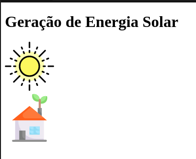
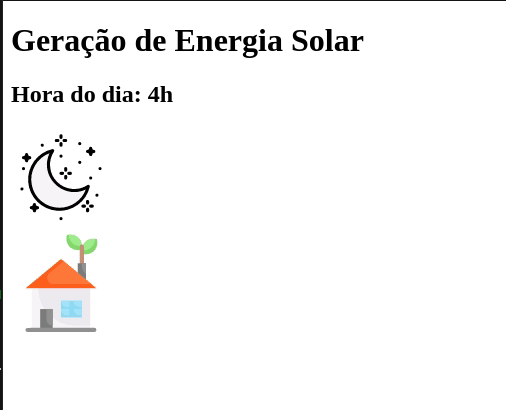

ReactJS Hooks

Olá jovens gafanhotos, seguindo a trilha de artigos a respeito dos Hooks, neste artigo irei falar sobre o `useEffect`.

Caso queira saber um pouco mais sobre os Hooks, você pode ler este conteúdo aqui:
[React Hooks, Introdução](https://blog.tautorn.com.br/reactjs-hooks/)

O `useEffect` (hook de efeito) é um Hook para ficar <i>ouvindo</i> as alterações que são realizadas no componente. Com ele podemos interagir com algumas funções do ciclo de vida do React, bem como era feito utilizando classes.

Quem possui experiência com React utilizando classes pode se familiarizar com alguns métodos que eram utilizados para controlar o componente, como:

* componentDidMount
* componentWillUnmount
* componentDidUpdate

Estes métodos também podem ser utilizados com o `useEffect`.

Mas caso esta seja a sua primeira experiência ou iniciou com React já utilizando Hooks sem passar por classes não se preocupe, irei explicar como o `useEffect` irá aplicar os efeitos no componente e depois irei apenas fazer uma demonstração com classe, mas este último não é obrigatório entendimento.

Mas antes vou demonstrar um pouco como funciona o ciclo de vida do React.

Podemos dividí-lo em 4 etapas:

* Inicialização
* Montagem
* Atualização
* Desmontagem


Durante a iniciliazação o componente recebe suas propriedades e incialização o estado inicial, isso caso ambas sejam informadas.

A etapa de **Montagem** existem duas que é o `render` e o `componentDidMount`. Apesar de na imagem constar o método `componentWillMount` ele não é mais utilizado por que foi depreciado na versão 16.3.0 e vai ser removido, por tanto, dependendo da vesão que você estiver utilizando ele pode nem mais existir, o mesmo é válido para os métodos `componentWillRecieveProps` e `componentWillUpdate`.

> Mantive na imagem para fins didáticos mas estes não devem ser mais utilizados.

Logo após temos a etapa de **Atualização** do componente onde é feito via `props` ou mudanças no `state` do componente. Esta etapa funciona em `loop` (vou explicar melhor mais abaixo).

E por fim temos a etapa de **Desmontagem** que é controlada pelo `componentWillUnmount`.

Perceba que em cada etapa é exposto uma forma de controle do componente podendo ser utilizado seus métodos ou não.

Na criação e atualização de um componente o React vai passar por cada etapa do seu ciclo de vida e dessa maneira podemos utilizar seus métodos para ter um controle melhor do que vai ser feito no componente.

É importante entender como o ciclo de vida funciona como um todo, saber o que acontece em cada etapa e caso haja necessidade então deve ser utilizado algum método para melhor proveito. Mas não recomendo ter que realizar um estudo afundo de tudo que está acontecendo, gosto de falar que o ideal é ter um entendimento 20/80. Onde 20% são de um conhecimento geral de como cada etapa funciona e 80% buscando uma compreensão e aplicação mais apurada, deixando esta última para ser aplicada de acordo com a necessidade/problema que você vai estar resolvendo.

Digo isso para que evite sair querendo utilizar todos os métodos de forma desnecessária, tente sempre manter a sua aplicação o mais simples possível e aplique os recursos somente vide necessidade.

### Como funciona o useEffect

O `useEffect` possui o seguinte corpo:

```jsx
// Desta maneira podemos simular o componentDidMount e o componentDidUpdate
useEffect(() => {
  document.title = `Tautorn Tech`;
})
```

No formato acima ele irá executar assim que o componente for renderizado, como se fosse um `construtor` e caso ele seja atualizado.
Logo, o `useEffect` é sempre executado a cada renderização do componente (montagem) e atualização.
<br />
##### Efeito sem limpeza

Esse formato é chamado de efeito **sem limpeza**, que é quando o Hook pode executá-lo e depois não vai mais ouvindo qualquer alteração/efeito.

Lembrando que a altereção é aplicada na montagem do componente e quando ele sofre alguma alteração, utilizando o <a target="_blank" href="https://blog.tautorn.com.br/reactjs-hooks">useState</a>, por exemplo.

Agora é possível `escutar` (termo que gosto de usar) o componente para que possamos realizar alguma alteração, podemos fazer na seguinte estrutura:

```jsx
// Desta maneira podemos executar o componentDidUpdate
useEffect(() => {
  document.title = siteName;
  // Sempre que siteName (uma variável qualquer) for alterada então execute este hook novamente e mude o título da página.
}, [siteName])
```

Repare que é possível passar **argumentos** (linha 5) para o `useEffect` afim de informá-lo quando ele deve realizar alguma alteração.
Desta maneira o componente está <i>ouvindo</i> esta variável e aplicando o efeito que está dentro do `useEffect`. Simples, não?!

É possível passar quantos argumentos forem necessários, mas é necessário precaução, porque é muito fácil cair em um `loop` caso os efeitos sejam informados de forma errada, como no cenário abaixo:

```jsx
// Desta maneira podemos simular o componentDidMount e o componentDidUpdate

const [name, setName] = useState('tautorn')

useEffect(() => {
  setName('bruno')
}, [name])
```

No exemplo acima toda vez que a variável `name` for alterada um efeito será aplicado onde o mesmo vai chamar o método `setState` para atualizar novamente o valor de `name`, com isso o componente irá entrar em `loop` até ocorrer um estouro de memória da aplicação.

Outro método do ciclo de vida que é possível executar utilizando o `useEffect` é o `componentWillUnmount`, que é a etapa de demonstagem do componente.

<br />
#### Efeitos com Limpeza
Nesta etapa é possível realizar o efeito com **limpeza**, onde podemos interromper um método para que não ocorra estouro de memória, por exemplo.

O exemplo mais básico (sim, você vai encontrar este exemplo em 11 de 10 pesquisas que realizar) é 
ao realizar a limpeza de uma função utilizando o `setInterval`.

```jsx
export default function Hello() {
  useEffect(() => {
    let interval = null;

    interval = setInterval(() => {
      console.log("Yupiiii")
    }, 1000);

    // Aqui estou executando o componentWillUnmount
    return () => clearInterval(interval);
  }, []);
}
```

No exemplo acima o componente `Hello` realizou a montagem e o `useEffect` foi executado (não passei argumentos para o `useEffect`, então ele vai ser executado somente uma vez) disparando o `setInterval` para que a cada 1 segundo ele dispare uma mensagem no console do browser. Mas repare que na **linha 10** adicionei um `return` com um `clearInterval` (método utilizado para que o setIternval pare de executar), com isso assim que o componente for desmontado o return vai ser executado disparando o `clearInterval`. Do contrário o `setInterval` poderia ficar executando infinitvamente até ocorrer um estouro de memória, ou somente executando de forma desnecessária e mesmo assim consumindo memória sem a necessidade.

> Um componente é desmontado quando realizamos uma troca de página, por exemplo, onde algo que existia não vai estar mais presente. Lembrando que o React trabalha de forma [declarativa](https://pt-br.reactjs.org/) (existe, não existe).

### Exemplo prático

Agora vou apresentar a criação de uma simulação de captura de energia solar passando pelo ciclo de vida do React utilizando o `useEffect`.

> A versão atual que estou utilizando para criar estes exemplos é a 17.0.2

Independente do ciclo correto, região ou fuso horário vamos imaginar que o Sol vai nascer e se pôr sempre das 06h às 18h, mantendo um ciclo diário de 12 horas.

> Me desculpem quem entender de captura de energia solar, gerei valores e formas aleatórias apenas para fins didáticos, o meu intúito é apenas demonstrar o funcionamento utilizando React.

Ficando assim o código:

```jsx
import { ReactComponent as Sun } from "./sun.svg";
import { ReactComponent as House } from "./house.svg";

export default function SolarSystem() {

  return (
    <div stlye={{ display: "flex" }}>
      <h1>Geração de Energia Solar </h1>
      <Sun height="100px" />
      <div>
        <House height="100px" />
      </div>
    </div>
  );
}

```
Resultado final:
<br />


Mas agora quero criar o efeito do sol nascendo e se pondo de acordo com horário que estipulei. Para isso vou criar um Hook utilizando o `useEffect`.

```jsx
import { useEffect, useState } from "react";
import { ReactComponent as Sun } from "./sun.svg";
import { ReactComponent as House } from "./house.svg";
import { ReactComponent as Moon } from "./moon.svg";

export default function SolarSystem() {
  const [hour, setHour] = useState(6);
  const [isActive, setIsActive] = useState(false);

  useEffect(() => {
    let interval = null;

    interval = setInterval(() => {
      setHour(hour + 1);
    }, 1000);

    if (hour > 23) {
      setHour(0);
    }

    return () => clearInterval(interval);
  }, [hour]);

  return (
    <div>
      <h1>Geração de Energia Solar </h1>
      <h2>Hora do dia: {hour}h </h2>
      {isActive ? <Sun height="100px" /> : <Moon height="100px" />}
      <div>
        <House height="100px" />
      </div>
    </div>
  );
}
```
Resultado final:
<br />


Com isso criei uma simulação do Sol nascendo e se pondo.
Agora vou explicar cada linha do useEffect e demonstrar quais etapas do ciclo de vida foram executadas.

A linha **7** e **8** estou utilizando o hook `useState` para criar o estado do componente, eles irão disparar o `componentDidMount`, que é a etapa de `montagem` do componente.

> A inicialização é o recebimento das propriedades e estado. Aqui poderia ser criado um componente que receba propriedades <SolarSystem kwh="1.57"> e as utilize.

A linha **11** à **19** eu criei um `timer` para simular a atualização da hora do dia, apresentando o valor na linha **27**. Este timer fica em **loop** incrementando 1h a ele mesmo, com isso disparando o método `componentDidUpdate` ao executar o `setHour` das linhas **14** e **18**.
Aqui vemos a etapa de `atualização` da aplicação.


Por fim, executei a etapa de `desmontagem` (componentWillUnmount) para que assim que o componente não existir mais o `setInterval` seja interrompido. Isto foi possível graças ao `return` da linha **21** ((efeito de limpeza).

Simples, não?! Com isso é possível passar por todas etapas do ciclo de vida combinando alguns `Hooks` do React.
Existem vários outros mas estes não irei apresentar agora.

#### Utilizando mais efeitos

Também é possível criar vários `useEffect` dentro do componente, assim como foi feito com o `useState`. Na verdade é possível fazer isso com qualquer Hook.

Para demonstrar este exemplo irei melhorar o componente de sistema solar, vou começar a capturar a nergia gerada no período que o sol está disponível. Ficando desta maneira:

```jsx
import { useEffect, useState } from "react";
import { ReactComponent as Sun } from "./sun.svg";
import { ReactComponent as House } from "./house.svg";
import { ReactComponent as Moon } from "./moon.svg";

const KWH = 1.57;

export default function SolarSystem() {
  const [hour, setHour] = useState(6);
  const [isActive, setIsActive] = useState(false);
  const [energy, setEnergy] = useState(0);

  useEffect(() => {
    let interval = null;

    interval = setInterval(() => {
      setHour(hour + 1);
    }, 1000);

    if (hour > 23) {
      setHour(0);
    }

    return () => clearInterval(interval);
  }, [hour]);

  useEffect(() => {
    if (hour > 5 && hour < 19) {
      setIsActive(true);
      setEnergy(energy + KWH);
    } else {
      setIsActive(false);
    }

    if (hour === 24) {
      setEnergy(0);
    }
  }, [hour]);

  return (
    <div>
      <h1>Geração de Energia Solar </h1>
      <h2>Hora do dia: {hour}h </h2>
      {isActive ? <Sun height="100px" /> : <Moon height="100px" />}
      <div>
        <House height="100px" />
        <p>Quantidade de energia gerada no dia: {energy.toFixed(2)} kw/h</p>
      </div>
    </div>
  );
}

```

> A funcionalidade desta aplicação pode ser encontrada em: [Code Sandbox](https://codesandbox.io/s/hooks-useeffect-h62v3?file=/src/App.js).

Adicionei algumas regras para que quando o sol estiver disponível o valor de energia gerado por hora vai ser armazenado em uma variável e depois apresentado no navegador.

```jsx
  useEffect(() => {
    if (hour > 5 && hour < 19) {
      setIsActive(true);
      setEnergy(energy + KWH);
    } else {
      setIsActive(false);
    }

    if (hour === 24) {
      setEnergy(0);
    }
  }, [hour]);
```

Reparei que o argumento que informei é o mesmo do primeiro `useEffect`, mas criei essa separação para poder separar melhor o código e poder ter um controle mais fácil da aplicação.

=D

Mais simples que painel de Jeep.

Por hoje é isso que desejo apresentar sobre o `useEffect`. É claro que existe mais uma infinidade de coisas que podem ser realizadas e além é claro do que **NÃO** deve ser feito mas isto irei deixar para outro momento.

Até mais :)


Para saber sobre o [useState](https://blog.tautorn.com.br/reactjs-hooks)

***Em breve vou atualizar esta página com exemplos do `useContext`***


Referências:

[ReactJS - Hooks Reference](https://reactjs.org/docs/hooks-reference.html)
[ReactJS - Hooks Effect](https://reactjs.org/docs/hooks-effect.html)
[Awesome React Hooks](https://github.com/rehooks/awesome-react-hooks)
[Enmascript](https://enmascript.com/articles/2018/10/26/react-conf-2018-understanding-react-hooks-proposal-with-simple-examples)