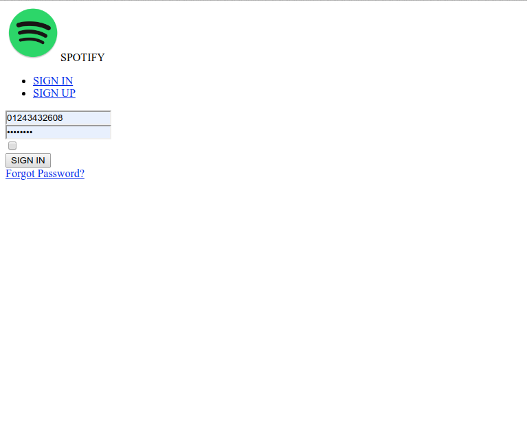

Hello =D

Bom, neste post vou falar um pouco de como utilizar CSS com React.

Neste exemplo, vou utilizar a lib [create-react-app](https://github.com/facebook/create-react-app) para construir a base inicial do projeto.

Obs.: Todo o projeto você pode conferir no meu [github](https://github.com/Tautorn/using-css-with-reactjs)

Para começar, digite os comandos abaixo:

```shell
npx create-react-app using-css-with-reactjs
cd using-css-with-reactjs
npm start

```

Vai ser criado a seguinte estrutura:

```shell
my-app
├── README.md
├── node_modules
├── package.json
├── .gitignore
├── public
│   ├── favicon.ico
│   ├── index.html
│   └── manifest.json
└── src
    ├── App.css
    ├── App.js
    ├── App.test.js
    ├── index.css
    ├── index.js
    ├── logo.svg
    └── serviceWorker.js
```

Matenha a estrutura de arquivos da seguinte maneira:


```shell
my-app
├── README.md
├── node_modules
├── package.json
├── .gitignore
├── public
│   ├── favicon.ico
│   ├── index.html
│   └── manifest.json
└── src
    ├── App.js
    ├── index.js
```

> App.js

```
import React from 'react';

function App() {
  return (
    <div>
      Hello =D
    </div>
  );
}

export default App;

```

> index.js

```
import React from 'react';
import ReactDOM from 'react-dom';
import App from './App';

ReactDOM.render(<App />, document.getElementById('root'))
```

Agora execute `npm run start` para subir a aplicação =D

Certo, uma aba do seu navegador irá abrir com a aplicação sendo executada. 
`http://localhost:3000/`

Tudo certo, agora vamos ao que interessa, CSS in JS \o/

Vou demonstrar como criar uma página de login do Spotify.

Primeiro, vou montar a estrutura HTML do nosso JSX

`gist:974518027e432bbed6ba0f77df2fc990`

Ficando desta maneira: 
<br />


Obs.: Deixei bem simples, só pra poder criar uma estrutura legal pra poder aplicar o estilo na página. Deixei inclusive os links sem href, é só um exemplo ;)

Blz, agora, é o momento de darmos vida a página \o/ 
Yuhuuuuuuuu

> Mas como fazer isso!? Já sei, INLINE!!!!!
```html
  <div style={{ width:'30px', color: 'red' }}>
```


Nãaao jovens gafanhotos!! Nunca faça inline, mantenha sempre um código consiso, de fácil manutenção e previsibilidade. As boas práticas vão continuar, não importa em que anos vamos estar e nem ferramentas utilizando. 

Já imaginaram a tripa que iria virar!? Sem contar no trabalho que ia ser giganteeeeso, fora a quantidade linda de bugs e a total despadronização do código.

Tá... blz, e agora, como aplicar o meu maravilhoso CSS com React? 

Vamos criar as boas e "velhas" classes!


Só que o React utiliza a nomenclatura `className` para utilizar uma classe em um componente. Exemplo:

```jsx
<span className="button-link">Cadê o onclick!?</span>
```

Então para estilizar a página de login eu vou simplesmente criar um arquivo **.css** e fazer a chamada no **App.js**

O `App.js` ficou assim:

```jsx
import React from 'react';
import Logo from './logo.png';
import './style.css';
```

E o `style.css` (criei na raíz do `src`) ficou assim:

```css
html, body {
  height: 100%;
}

body {
  margin: 0;
  padding: 0;
  box-sizing: border-box;
  background:#2E3034;
}
```

Basta criar os arquivos, salvar e ver a página sendo alterada ;D. Tudo o que for escrito no seu arquivo CSS vai funcionar normalmente dentro dos arquivos JS.

> Importante, essa abordagem funciona "magicamente" porque utilize o `create-react-app` para montar toda a estrutura do projeto e por padrão o compilador do código já vem todo configurado, que no caso é o [`webpack`](https://webpack.js.org/), que é um module bundler e faz todo o "trabalho sujo" pra gente, não apenas de css, são várias outras coisas (dariam outro artigo hehehe) ;D 

> Se por acaso você preferir configurá-lo manualmente você vai precisar adicionar o [`css-loader`](https://github.com/webpack-contrib/css-loader) para que os arquivos css sejam chamados dentro dos seus arquivos JS.

> Existem outros modules bundlers também, como o [Rollup](https://rollupjs.org/guide/en/) e o [Parcel](https://parceljs.org/), cada um tem suas características e se adequam melhor a cada cenário.

Blz, agora voltando ao css :P

Adicionei algunas classes no arquivo `style.css`, ficando desta maneira: 

`gist:b8dce84b5063694d45de33ab15b2b718`

Reparem que a criação do CSS continua a mesma, nada mudou. 

Agora, basta alterar o App.js, adicionando as classes conforme abaixo:

`gist:1b397f84e176f291d3b4b48bfcbde3b6`

